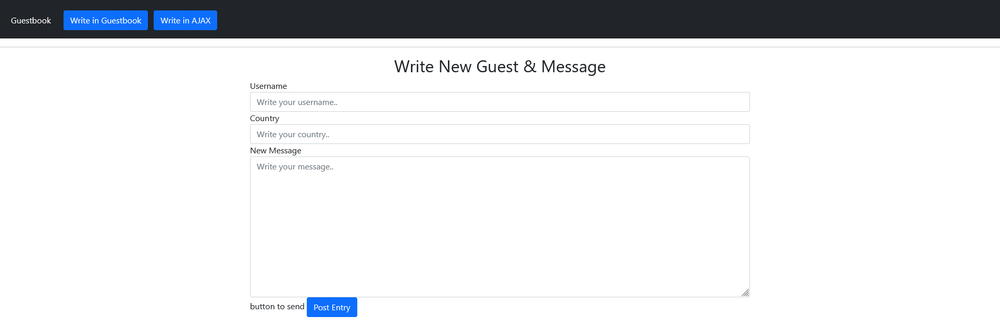

# GUESTBOOK APP

GuestBook on sovellus, jolla voit tallentaa viestin luetteloon, eli kirjastoon. Kaikki tiedot tallennetaan JSON-tiedostoon. 

# ScreenShoot

# Installation

Lisään myöhemmin..

# Environment Variables

- `PORT`, Serverin portti on `4000`.

Also you can create a .env file with the environment variables mentioned above.

# Hostaus

`

then visit: `http://localhost`

